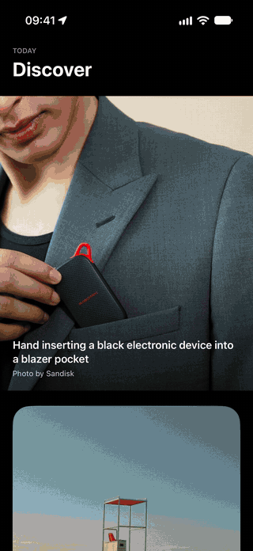

# PhotoFeed

A sample iOS 17+ SwiftUI app powered by the Unsplash API.

PhotoFeed feats an infinite scrolling photo feed with unobtrusive sponsored content insertion, image prefetching for smooth scrolling, and a custom matched transition into a detail view featuring photographer photos and statistics.

## Demo
  <p align="left">
    
  </p>

## Running the app

Open `PhotoFeed.xcodeproj` and run the `PhotoFeed` scheme.

The app runs against bundled JSON fixtures by default and does not require any additional configuration.

### Live Unsplash API

To run against the live API:

1. Rename `Secrets.example.xcconfig` to `Secrets.xcconfig`.
2. Replace `your_key_here` with a valid Unsplash API access key:

```text
UNSPLASH_ACCESS_KEY = your_key_here
```

3. In `PhotoFeedApp.swift`, change:

```swift
private static let environment: Environment = .fixture
```

to:

```swift
private static let environment: Environment = .live
```